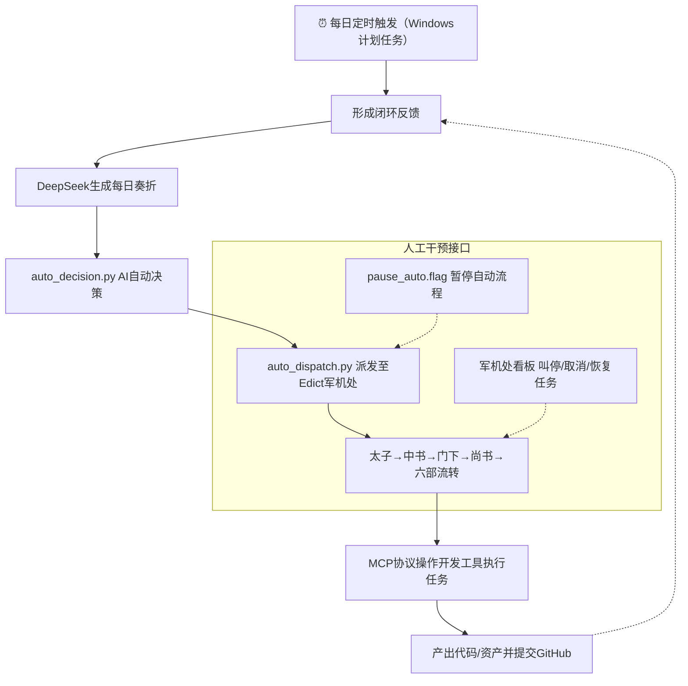

# 🏛️ 全自动AI游戏帝国 · 赛博朝廷

> 一人即团队，对话即开发。基于“三省六部制”思想的AI多智能体游戏开发自动化框架。

[](https://opensource.org/licenses/MIT)
[](https://github.com/cft0808/edict)
[](https://www.deepseek.com/)

---

## 📖 项目简介

**全自动AI游戏帝国**是一个将古代唐朝“三省六部制”的分权、制衡与专业化思想，应用于现代AI多智能体协作的**游戏开发自动化框架**。

它通过模拟一个由 **12个专职AI Agent** 组成的“赛博朝廷”，将你（皇帝/项目总监）的模糊需求，自动拆解、审核、派发、执行，最终产出可运行的代码、资产和文档，实现 **L5级全自动游戏开发**——AI自主感知进度、做出决策、编写代码、生成资产、测试打包，你只负责监督和关键节点选择。

核心优势：相比传统多智能体框架（CrewAI/AutoGen/MetaGPT），本框架新增**制度性审核（门下省）、实时可观测看板（军机处）、全流程可干预**三大核心能力，解决AI协作“结果不可控、过程不可追溯”的痛点。

---

## 🧠 核心理念（三省六部制落地）

| 古代官制 | 现代职能 | 在本框架中的AI Agent角色 |
| :--- | :--- | :--- |
| **皇帝** | 项目总监 | **你**：提出愿景，做出关键决策，查看进度与奏折。 |
| **太子** | 需求分拣 | 自动区分闲聊与正式旨意，仅将开发需求传入三省流转。 |
| **中书省** | 创意与规划 | 负责需求分析、竞品调研、方案设计与任务拆解，输出可落地执行计划。 |
| **门下省** | 审核与风控 | 专职审核方案可行性、质量与合规性，不合格则“封驳”打回重做（强制质量关卡）。 |
| **尚书省** | 调度与协调 | 将审核通过的任务派发给六部，实时追踪进度，协调多部门并行协作。 |
| **六部** | 专项执行 | 兵部(代码开发)、户部(数值设计)、礼部(文档/美术)、刑部(测试/合规)、工部(资产/部署)、吏部(Agent管理)。 |

---

## 🏗️ 架构蓝图（三层金字塔）

```
┌─────────────────────────────────────────────────────────────┐
│                     👑 决策与规划层 (Cursor + DeepSeek)      │
│  你下达旨意 → 太子分拣 → 中书省规划 → 门下省审核 → 任务拆解  │
└─────────────────────────────────────────────────────────────┘
                                    │
                                    ▼
┌─────────────────────────────────────────────────────────────┐
│                  🏛️ 调度与协作层 (Edict + OpenClaw)          │
│  任务进入军机处看板 → 尚书省派发 → 六部并行执行 → 进度反馈    │
└─────────────────────────────────────────────────────────────┘
                                    │
                                    ▼
┌─────────────────────────────────────────────────────────────┐
│               🔌 执行与反馈层 (MCP协议 + 开发工具)           │
│  AI操作星火编辑器写代码 · AI操作Blender做模型 · Git自动提交  │
│  AI执行测试 · 自动打包部署 · 结果归档为奏折                  │
└─────────────────────────────────────────────────────────────┘
```

### 全自动工作流（可视化）



---

## 🧱 核心组件清单（必装+可扩展）

### 必装基石（Windows环境适配）

| 软件/组件 | 角色 | 获取/配置方式 |
| :--- | :--- | :--- |
| **DeepSeek** | AI大脑（底层算力） | 注册获取 [API Key](https://www.deepseek.com/)，配置到Cursor与Edict |
| **Cursor** | 人机交互中枢 | [下载](https://cursor.com)，配置DeepSeek Key与MCP协议 |
| **Edict** | 三省六部核心框架 | `git clone https://github.com/cft0808/edict.git`（开源MIT协议） |
| **OpenClaw** | AI调度网关 | `npm install -g openclaw`（Edict依赖调度工具） |
| **Python 3.9+** | 胶水脚本运行环境 | [下载](https://python.org)，安装requests、openai等依赖 |
| **Node.js 18+** | 运行环境（Edict/OpenClaw） | [下载](https://nodejs.org) |
| **Git** | 版本控制（代码/奏折归档） | [下载](https://git-scm.com)，配置全局用户名/邮箱 |

### 可扩展“砖瓦” (MCP/API接口库)

| 类别 | 可选工具 | 集成价值 | 集成方式 |
| :--- | :--- | :--- | :--- |
| **资产生成** | Blender MCP, Meshy AI | AI生成3D模型、纹理、精灵图 | MCP协议 / REST API |
| **引擎操作** | Unity MCP, Godot MCP | AI直接操作游戏引擎，搭建场景、编写脚本 | MCP协议 / 引擎插件 |
| **测试保障** | GameDriver, Qodana | 自动化测试、代码审查、错误追踪 | API / SDK / MCP |
| **数据运营** | GameAnalytics, PlayFab | 玩家数据分析、游戏经济系统管理 | API / SDK |
| **一键部署** | 阿里云函数计算, TapTap TDS | AI自动构建、打包、发布游戏 | API / MCP |
| **音频生成** | ElevenLabs, 微软Azure AI语音 | 文本生成游戏音效、角色语音 | REST API / SDK |
| **叙事生成** | SillyTavern, Lore Forge | AI生成动态剧情、角色对话 | API / 框架集成 |

---

## 🚀 快速开始（Windows实操）

### 1. 克隆并部署Edict（三省六部框架）

```bash
# 克隆Edict开源项目
git clone https://github.com/cft0808/edict.git
cd edict
# Windows专属安装（自动备份用户配置，避免覆盖）
.\install.ps1
```

### 2. 配置OpenClaw与DeepSeek（打通AI调度）

```bash
# 初始化OpenClaw，绑定DeepSeek模型
openclaw onboard
```
按终端提示，选择 **DeepSeek**，输入你的DeepSeek API Key，完成绑定。

### 3. 启动“赛博朝廷”（需保持3个终端运行）

1.  终端1（调度网关）：`openclaw gateway`
2.  终端2（任务循环）：`.\scripts\run_loop.ps1`
3.  终端3（军机处看板）：`python dashboard/server.py`

启动后，访问 `http://127.0.0.1:7891` 进入军机处总控台，可实时查看任务进度、干预任务。

### 4. 连接Cursor（实现对话式开发）

在Cursor中按 `Ctrl + Shift + P`，输入 `View: Open MCP Settings`，打开`mcp.json`，添加以下配置（对接Edict）：

```json
{
  "mcpServers": {
    "edict-agent": {
      "command": "python",
      "args": ["-m", "edict.backend.mcp_server"],
      "cwd": "你的Edict项目绝对路径",
      "env": {
        "PYTHONPATH": "你的Edict项目绝对路径"
      }
    },
    "github": {
      "command": "npx",
      "args": ["-y", "@modelcontextprotocol/server-github"],
      "env": {
        "GITHUB_PERSONAL_ACCESS_TOKEN": "你的GitHub Token"
      }
    }
  }
}
```

保存后重启Cursor，即可通过自然语言下达开发旨意，自动流转至Edict执行。

---

## 📊 成本与效率参考

| 指标 | 估算值 | 说明 |
| :--- | :--- | :--- |
| **每日Token成本** | ¥3 - ¥150 | 取决于任务活跃度，可通过优化脚本降低消耗 |
| **普通小游戏开发周期** | 2 - 4个月 | 单人+AI全自动，无需额外团队 |
| **幸存者Like+创新机制开发周期** | 4.5 - 7个月 | 复杂玩法+资产，AI提效5-10倍 |
| **相比传统单人开发提效** | **5 - 10倍** | 减少重复性编码、资产生成、任务管理时间 |

---

## 📁 项目结构（规范整理）

```
全自动AI游戏帝国/
├── edict/                     # 三省六部核心框架（开源引入）
│   ├── agents/                # 12个AI Agent配置（太子+三省+六部）
│   ├── dashboard/             # 军机处看板前端/后端
│   ├── scripts/               # Edict内置脚本
│   └── docker/                # Docker部署配置
├── scripts/                   # 自定义自动化胶水脚本
│   ├── read_progress.py       # 进度收集（对接Git/Edict）
│   ├── daily_report.py        # 每日奏折生成
│   ├── auto_decision.py       # AI自动决策逻辑
│   └── send_to_edict.py       # 任务派发至Edict
├── proposals/                 # 每日奏折存档（自动生成）
├── .cursor/                   # Cursor配置（MCP协议+模型设置）
└── docs/                      # 详细文档（实施路线图、故障排查）
```

---

## 🛣️ 实施路线图（按阶段落地）

- [x] **阶段一：奠基** - 部署Edict，跑通单个Agent，验证核心框架可用（1-2周）
- [x] **阶段二：建制** - 编写Python脚本，配置Windows计划任务，实现每日自动上奏（1周）
- [x] **阶段三：通神经** - 配置Cursor的MCP，连接GitHub、文件系统，让AI能“动手”（1周）
- [ ] **阶段四：实执行** - 打通星火编辑器CustomLib桥接器，让AI操作游戏引擎（2-4周）
- [ ] **阶段五：全自动** - 部署自动决策引擎，实现从创意到代码的全闭环（2-4周）
- [ ] **阶段六：添砖瓦** - 按需接入扩展工具（音频/测试/部署），持续优化（持续进行）

---

## 🤝 贡献与声明

### 核心依赖（开源致谢）
本项目基于以下开源项目构建，遵循对应开源协议：
- [Edict](https://github.com/cft0808/edict) - 三省六部AI多智能体协作框架（MIT License）
- [OpenClaw](https://github.com/openclaw/openclaw) - AI Agent调度网关
- [MCP协议](https://modelcontextprotocol.io/) - 模型上下文协议（工具连接核心）

### 开源声明
本项目采用 **MIT License**（与Edict一致），允许自由使用、复制、修改、合并、发布、分发、再许可和/或出售本软件的副本，需保留版权和许可声明。

**⚠️ 注意**：本蓝图中的`auto_decision.py`等自动化脚本需根据个人项目定制，请勿在生产环境中直接运行未经审查的AI决策，避免风险。

欢迎提交Issue讨论想法，或Fork本项目，构建属于你自己的“赛博朝廷”。

---

## 📄 许可证

[MIT License](https://opensource.org/licenses/MIT) © 2025 [你的GitHub用户名]

Permission is hereby granted, free of charge, to any person obtaining a copy of this software and associated documentation files (the "Software"), to deal in the Software without restriction, including without limitation the rights to use, copy, modify, merge, publish, distribute, sublicense, and/or sell copies of the Software, subject to the following conditions:

The above copyright notice and this permission notice shall be included in all copies or substantial portions of the Software.

THE SOFTWARE IS PROVIDED "AS IS", WITHOUT WARRANTY OF ANY KIND, EXPRESS OR IMPLIED, INCLUDING BUT NOT LIMITED TO THE WARRANTIES OF MERCHANTABILITY, FITNESS FOR A PARTICULAR PURPOSE AND NONINFRINGEMENT. IN NO EVENT SHALL THE AUTHORS OR COPYRIGHT HOLDERS BE LIABLE FOR ANY CLAIM, DAMAGES OR OTHER LIABILITY, WHETHER IN AN ACTION OF CONTRACT, TORT OR OTHERWISE, ARISING FROM, OUT OF OR IN CONNECTION WITH THE SOFTWARE OR THE USE OR OTHER DEALINGS IN THE SOFTWARE.
